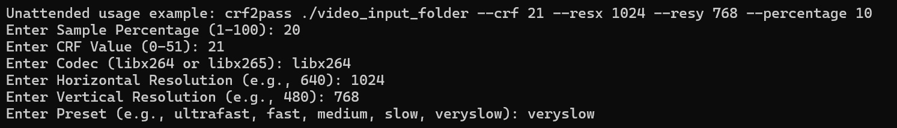
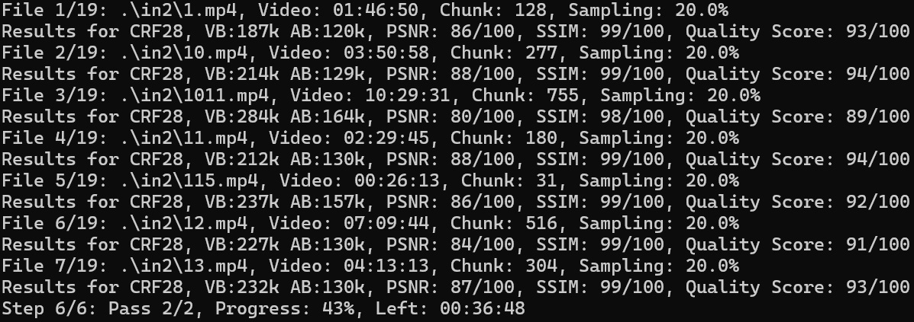

## Overview
Execute this program with a file or folder to process video files. The program:
1. Samples a video with CRF to approach a target bitrate based on video complexity and resolution.
2. Encodes the video in 2-pass mode using results from sampling.

For each file, quality metrics (SSIM & PSNR) will be displayed, allowing comparison across CRF samples.

## Usage
Run the program interactively to prompt for video input and parameters, or use command-line arguments for unattended execution.

### Parameters for Unattended Execution
- `-p`, `--percentage` (float, default=5.0): Sample percentage (1-100)
- `-c`, `--crf` (int, default=28): CRF value (0-51)
- `-l`, `--codec` (default="libx264"): Codec (`libx264` or `libx265`)
- `-x`, `--resx` (int, default=640): Horizontal resolution (e.g., 640)
- `-y`, `--resy` (int, default=480): Vertical resolution (e.g., 480)
- `-e`, `--extension` (default="*.mp4"): File extensions to process
- `-s`, `--preset` (default="veryslow"): Encoding preset (`ultrafast`, `fast`, `medium`, `slow`, `veryslow`)

### Screenshots

## Prerequisites
FFmpeg and FFprobe available on path

## To-Do List
### Should-Do:
- Allow choice of audio codec, channels, and bitrate
- Set custom frame rate, profile, and tuning options
- Support additional video types
- Improve QOL by allowing a custom output folder
- Yes, yes, code cleaning

### Would-Be-Nice:
- Choose ffmpeg/ffprobe folder (for non-path installations)
- Option to generate only sampling (skip lossless counterpart)
- Maintain aspect ratio adjustments (auto or manual)
- Bitrate calculation based on quality metrics instead of CRF

## Inspiration
This project was inspired by discussions on Reddit:
- [h264: 1-pass, 2-pass and... 3-pass?](https://www.reddit.com/r/ffmpeg/s/GF1nkhH5b8)
- [Turning my library into MKV, 1 pass vs 2 pass?](https://www.reddit.com/r/PleX/s/Pb5CR7XNFo)
